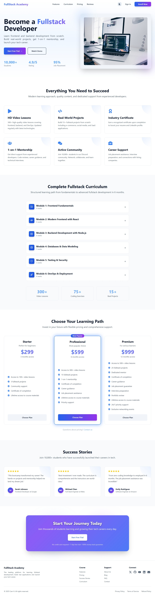
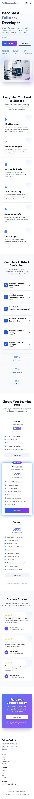
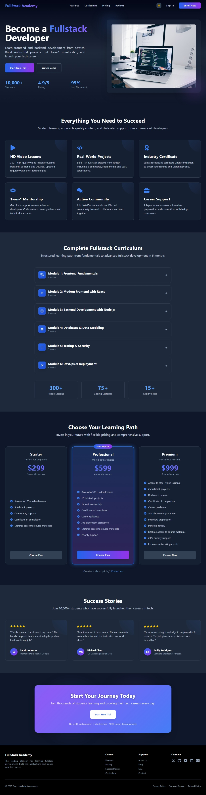

# 🎓 FullStack Academy

A modern, responsive landing page for a coding bootcamp built with React, TypeScript, and Tailwind CSS.


## ✨ Features

### 🎨 **Modern UI/UX**
- Responsive design for all devices (mobile, tablet, desktop)
- Dark mode support with smooth transitions
- Smooth animations and hover effects
- Gradient backgrounds and decorative elements
- Glassmorphism effects

### 📄 **Pages**
- **Home** - Hero section, features, curriculum, pricing, testimonials
- **About Us** - Company story, mission, team
- **Blog** - Article listing with categories
- **FAQ** - Accordion-style frequently asked questions
- **Contact** - Contact form with social links
- **Privacy Policy** - Privacy and data protection
- **Terms of Service** - Terms and conditions
- **Refund Policy** - Money-back guarantee details
- **404 Page** - Custom not found page

### 🎯 **Key Components**
- **Navigation** - Dynamic navigation (hash links for home, routes for other pages)
- **Hero Section** - Eye-catching landing with CTA buttons
- **Features Section** - Highlight key benefits
- **Curriculum Section** - Course modules with interactive tabs
- **Pricing Cards** - Three pricing tiers with enrollment modal
- **Testimonials** - Student success stories
- **Footer** - Links, social media, newsletter signup

### 🎭 **Modals**
- **Sign In Modal** - Authentication with social login options
- **Enroll Modal** - 3-step enrollment process (Plan → Info → Payment)

### 🔧 **Technical Features**
- React Router v7 for navigation
- Context API for modal state management
- TypeScript for type safety
- Tailwind CSS for styling
- Custom animations and transitions
- Scroll reveal effects
- Mobile-friendly hamburger menu

### Prerequisites
- Node.js (v18 or higher)
- npm or yarn

## 📸 Screenshots

### Desktop View


### Mobile View


### Dark Mode


### Installation

1. **Clone the repository**
```bash
git clone https://github.com/yourusername/fullstack-academy.git
cd fullstack-academy
```

2. **Install dependencies**
```bash
npm install
```

3. **Start development server**
```bash
npm run dev
```

4. **Open your browser**
```
http://localhost:5173
```

## 📦 Available Scripts

| Script | Description |
|--------|-------------|
| `npm run dev` | Start development server with hot reload |
| `npm run build` | Build for production |
| `npm run preview` | Preview production build locally |
| `npm run lint` | Run ESLint to check code quality |

## 🔌 Key Technologies

### Core
- **React 19.1.1** - UI library
- **TypeScript 5.9.3** - Type safety
- **Vite 7.1.7** - Build tool

### Styling
- **Tailwind CSS 3.4.17** - Utility-first CSS
- **PostCSS** - CSS processing
- **Autoprefixer** - Browser compatibility

### Routing & State
- **React Router 7.9.5** - Client-side routing
- **Context API** - Global state management

### UI & Icons
- **React Icons 5.5.0** - Icon library

## 📱 Responsive Design

The entire application is fully responsive with:
- Mobile-first approach
- Flexible grid layouts
- Responsive typography
- Touch-friendly buttons (min 44px)
- Optimized images

## 🎭 Animations

Custom CSS animations in `App.css`:
- Fade in/out effects
- Scale animations
- Slide animations
- Pulse effects
- Gradient animations
- Hover effects

## 🔒 Best Practices

- ✅ TypeScript for type safety
- ✅ Component-based architecture
- ✅ Reusable UI components
- ✅ Context API for state management
- ✅ Clean folder structure
- ✅ Responsive design
- ✅ Accessibility considerations
- ✅ SEO-friendly routing

## 📝 License

This project is licensed under the MIT License - see the [LICENSE](LICENSE) file for details.

## 👥 Authors

- Cam H. - [linyao926](https://github.com/linyao926)

## 🙏 Acknowledgments

- Design inspiration from modern bootcamp websites
- Icons from React Icons
- Images from Unsplash
- Tailwind CSS for rapid styling

---

⭐ **Star this repo if you find it helpful!** ⭐

Made with ❤️ by linyao926